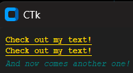

# 💻 ctkTerminal

**ctkTerminal** is a custom terminal-like widget built with [CustomTkinter](https://github.com/TomSchimansky/CustomTkinter) — a modern and beautiful UI library for Python's `tkinter`.

**ctkTerminal** é um widget estilo terminal personalizado, construído com base no [CustomTkinter](https://github.com/TomSchimansky/CustomTkinter) — uma biblioteca moderna e bonita para interfaces com `tkinter` em Python.

---

## Features / Recursos

Its main purpose is to make it easy to insert to a custom CTkTextbox various colors and styles using ANSI characters, just like you were using the VSCode integrated terminal, for example.

- Easy to integrate into any CustomTkinter application  
- Fully customizable styles and layout  
- Lightweight and responsive design  
- Ready for future improvements like input/output simulation

---

## Class CTkTerminal

```py
class CTkTerminal(
    self: Self@CTkTerminal,
    root:           ctk.Ctk,
    font:           str = "Courier",
    size:           int = 12,
    text_color:     str = "white",
    bg_color:       str = "gray12"

    # Adds the formatted text to your terminal
    (method) def addText(
        text: Any,
        style: str = "auto",
        color: str = "auto",
        font: str = "Courier",
        size: int = 12,
        justify: str = "left"
    ) -> None

    # Clears terminal lines, from line to line+line_span
    (method) def clear(
        self: Self@CTkTerminal,
        line: int,
        line_span: int
    ) -> None

    # Called by addText, returns a list filtered with each segment of the text and its formatting
    (method) def recognizeColors(
        self: Self@CTkTerminal,
        text: Any
    ) -> (list[list] | list)
) 
```

When an instance of CTkTerminal is initialized, it creates an instance of CTkTextbox and assigns the custom values passeds to it. It is necessary to use a geometry management at the CTkTerminal textbox, just like any other CTk component.
It provides a huge set of colors, beyond the classic ANSI codes supported natively by Python:

```txt
Color Documentation (ANSI Codes and Hexadecimal Values)

31 - red          - #FF0000
32 - green        - #00FF00
33 - yellow       - #FFFF00
34 - blue         - #0000FF
35 - purple       - #800080
36 - cyan         - #00FFFF
37 - white        - #FFFFFF
38 - dark_blue    - #00008B
39 - orange       - #FFA500
40 - gold         - #FFD700
41 - dark_red     - #8B0000
42 - dark_green   - #006400
43 - gray         - #808080
44 - dark_gray    - #A9A9A9
45 - light_gray   - #D3D3D3
46 - dark_purple  - #4B0082
47 - teal         - #008080
48 - pink         - #FFC0CB
49 - lime         - #00FF40
50 - beige        - #F5F5DC
```

You can pass your string (the line that is going to be added) and its formatting to your textbox using the method *addText*.
You can either define the color and style via its parameters or using the ANSI characters.

For example, if you want to add a golden text formatted with bold and underline, you can use:
```py
root = ctk.CTk()
my_terminal = CTkTerminal(root)
my_terminal.textbox.pack()
my_terminal.addText('Check out my text!\n', color="gold", style="bold underline") # via parameters
my_terminal.addText('\033[14;40mCheck out my text!\033[3;47m\nAnd now comes another one!') # via ANSI
```

## Class TerminalRedirector

When initialized, it changes the value of sys.stdout to itself. In other words, the default prints will be formatted and redirected to your widget (preferably an instance of CTkTerminal).

```py
class TerminalRedirector(
    self: Self@TerminalRedirector,
    widget: CTkTerminal | CTkTextbox,
    original_stdout: TextIO | Any = sys.stdout

     # Prints in your widget
    (method) def write(
        self: Self@TerminalRedirector,
        message: Any
    ) -> None

    # Returns outputs to the original terminal
    (method) def deactivate(self: Self@TerminalRedirector) -> None
) 
```
Example of use:
```py
widget = CTkTerminal(root)
widget.textbox.pack()
redirector = TerminalRedirector(widget)
print("\033[14;40mMy terminal is so cool\033[m") # Printed inside your terminal/widget
redirector.deactivate()
print("\033[14;36mMeu terminal é muito legal\033[m") # Printed in the original terminal
```

Result:
<p align="center"></p>

---

## 📦 Installation / Instalação

```bash
# Install
pip install git+https://github.com/gabrielTessarolo/ctkTerminal.git

# Update
pip install --upgrade --force-reinstall git+https://github.com/gabrielTessarolo/ctkTerminal.git
```

- Developed by Gabriel Tessarolo Helmer
